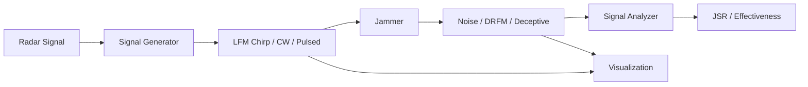

# RadarJammer

**Electronic Warfare Radar Jamming Simulation**

[](https://www.python.org/)
[](LICENSE)
[](https://github.com/mehmetd7mir/RadarJammer/actions)
[]()

> Simulate radar signals and electronic countermeasures (ECM) jamming techniques.

> [!NOTE]
> 🤖 This project was **vibe coded** — built with AI assistance as a learning exercise to explore electronic warfare concepts.

---

## Features

- Generate realistic radar waveforms (CW, Pulsed, LFM Chirp, FMCW)
- Multiple jamming techniques (Noise, Spot, Sweep, Deceptive, DRFM, Barrage)
- Jamming-to-Signal Ratio (JSR) calculation
- Signal analysis tools (SNR, bandwidth, signal type detection)
- Spectrum and spectrogram visualization
- ECM (Electronic Countermeasures) response system

## How It Works



## Radar Signals

| Signal Type | Description | Use Case |
|------------|-------------|----------|
| **CW** | Continuous single frequency | Speed measurement |
| **Pulsed** | Short bursts with gaps | Range detection |
| **LFM Chirp** | Frequency sweeps linearly | Range + speed |
| **FMCW** | Repeated chirps | Automotive radar |

## Jamming Techniques

| Technique | How It Works | Effectiveness |
|-----------|-------------|---------------|
| **Noise** | Overwhelm with broadband noise | High power needed |
| **Spot** | Jam single frequency | Efficient but avoidable |
| **Sweep** | Sweep across frequency band | Good balance |
| **Deceptive** | Create false target echoes | Hard to detect |
| **DRFM** | Record and replay with modifications | Most advanced |
| **Barrage** | Jam multiple bands at once | Wide coverage |

## Quick Start

```bash
# install dependencies
pip install -r requirements.txt

# run demo
python main.py --demo

# with visualization
python main.py --demo --visualize

# run specific technique
python main.py --mode noise --visualize
```

### Example Output

```
==================================================
  RadarJammer - Electronic Warfare Simulation
==================================================

[DEMO] Running jamming demonstration...

Signal: LFM Chirp (1 MHz bandwidth)
Noise Jamming:     JSR = 8.5 dB  [EFFECTIVE]
Spot Jamming:      JSR = 12.3 dB [EFFECTIVE]
Sweep Jamming:     JSR = 6.1 dB  [MARGINAL]
Deceptive Jamming: 5 false targets created
DRFM Jamming:      Doppler shift = 1000 Hz
```

## Project Structure

```
RadarJammer/
├── main.py                     # entry point
├── src/
│   ├── signals/
│   │   └── radar_generator.py         # radar waveform generation
│   ├── jamming/
│   │   └── jammer.py                  # jamming techniques + ECM
│   ├── analysis/
│   │   └── signal_analyzer.py         # SNR, bandwidth, effectiveness
│   └── visualization/
│       └── plots.py                   # spectrum and signal plots
├── tests/                      # 40 unit tests
├── docs/                       # documentation
└── .github/workflows/          # CI pipeline
```

## Running Tests

```bash
pip install pytest
pytest tests/ -v
```

## Tech Stack

| Component | Technology |
|-----------|------------|
| **Signal Processing** | NumPy, SciPy |
| **Visualization** | Matplotlib |
| **Testing** | pytest |

## Author

**Mehmet Demir** - [GitHub](https://github.com/mehmetd7mir)
